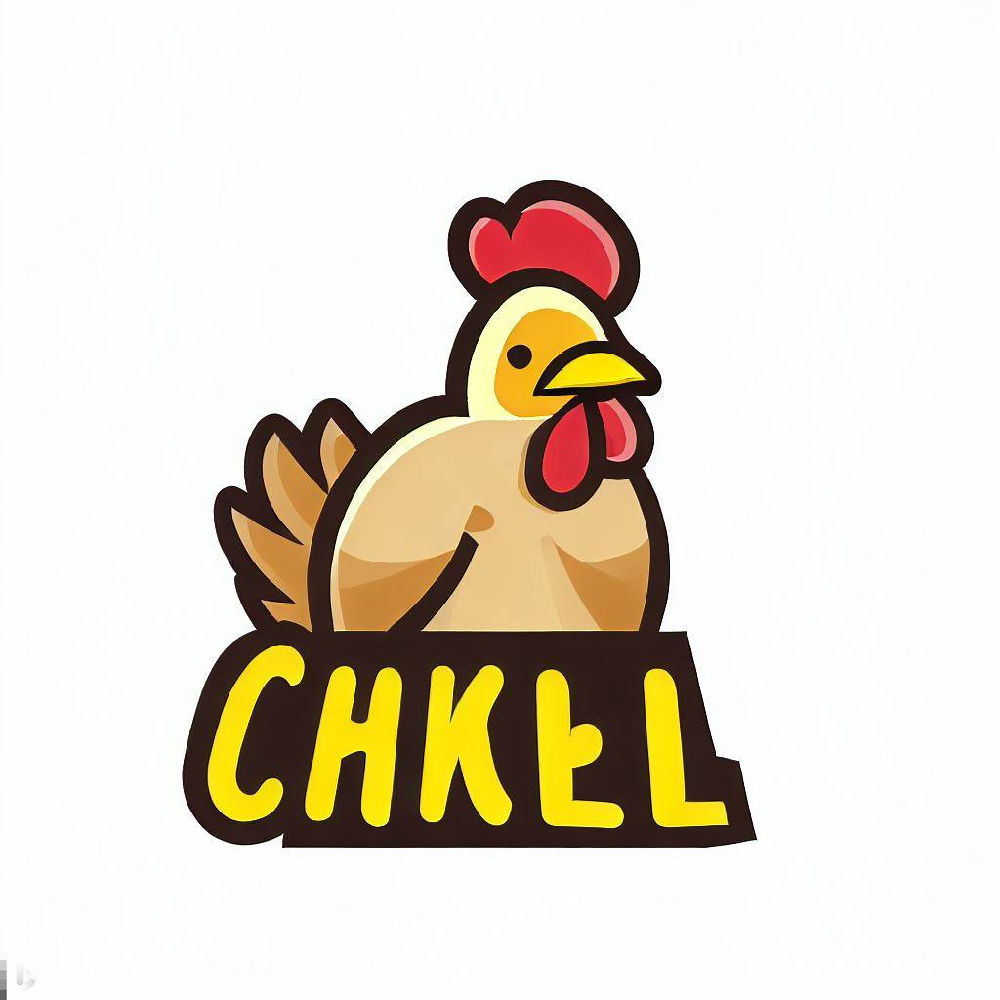

# Alumno Patricio tiene un e-commerce llamado Granja San Jose
## Granja San Jose
 "Granja San Jose" es un empresa familiar con 20 años de trayectoria. Comenzando como un pequeño negocio en un barrio, con el fin de conseguir una fuente de ingreso, logro un gran e inesperado crecimiento que los llevo a abrir varias sucursales en distintos puntos de la provincia y tener su propio punto de reabastecimiento. En la actuliad, la empresa comercializa sus productos de manera minorista y mayorista, no solo en la provincia si no tambien por el pais y exportando.
 Los productos que comercializa son:
 * Cajones de pollo de distintos tamaños
 * Derivados de pollo congelados, como pueden ser nuggets, medallones de pollo, hamburguesas, albondigas, etc.
 * Distintos tipos de cortes de pollo por mayor y menor
## Publico Objetivo
 El publico al que esta diriga la empresa es para cualquier persona, casas familiares, PyME tantos nacionales como internacionales.
## Tipografia Principal
 ### Titulos
 Ubuntu
 ### Subtitulos 
 Space+Grotesk
 ### Texto
 Arimo
## Paleta de colores
E3F6FF, FFEA20, F86F03
## Logo
https://th.bing.com/th/id/OIG.POLtRvWCyEbLgjSoK59r?pid=ImgGn
